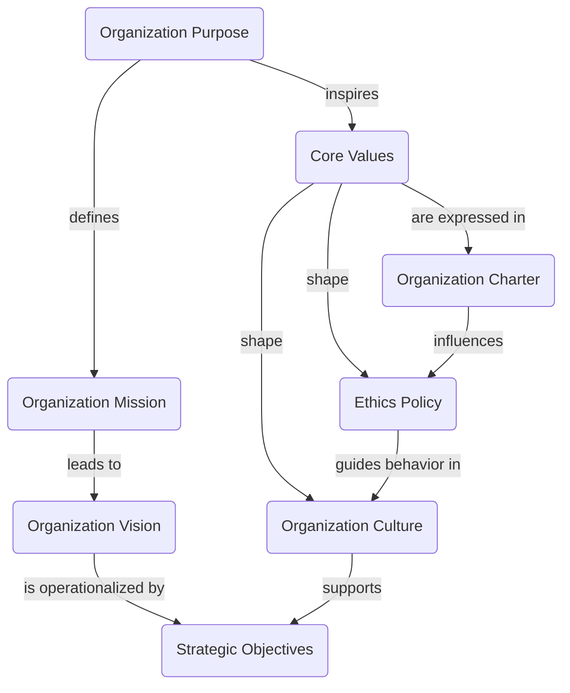

# Organization operating model

## Compact terminology

- **Organization Purpose**: why the organization exists.
- **Organization Mission**: what the organization does now.
- **Organization Vision**: target future state.
- **Strategic Objectives**: measurable outcomes that realize the vision.
- **Core Values / Ethics / Culture / Charter**: behavioral system that supports strategy.
