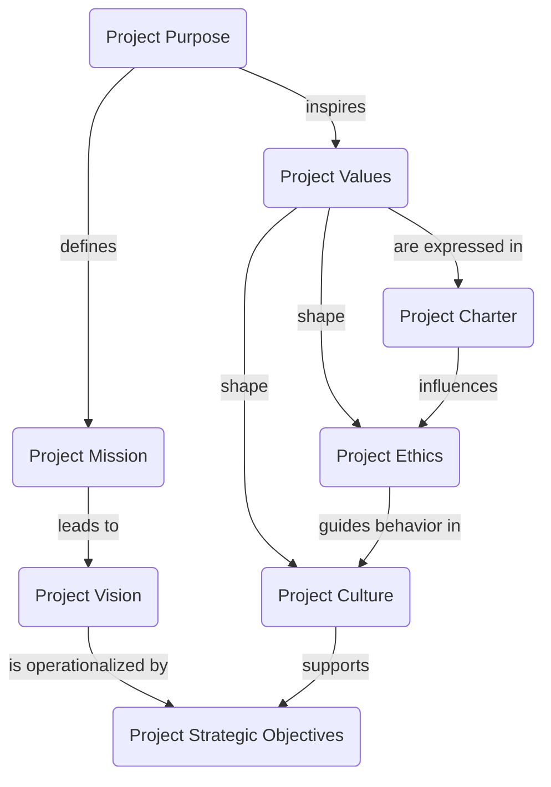

# Project foundation model

## Scope boundary

- **Organization purpose** lives at org level and is documented in [Organization operating model](../org/operating_model.md).
- **Project purpose** is repository-specific and can be narrower while staying aligned with organization strategy.
